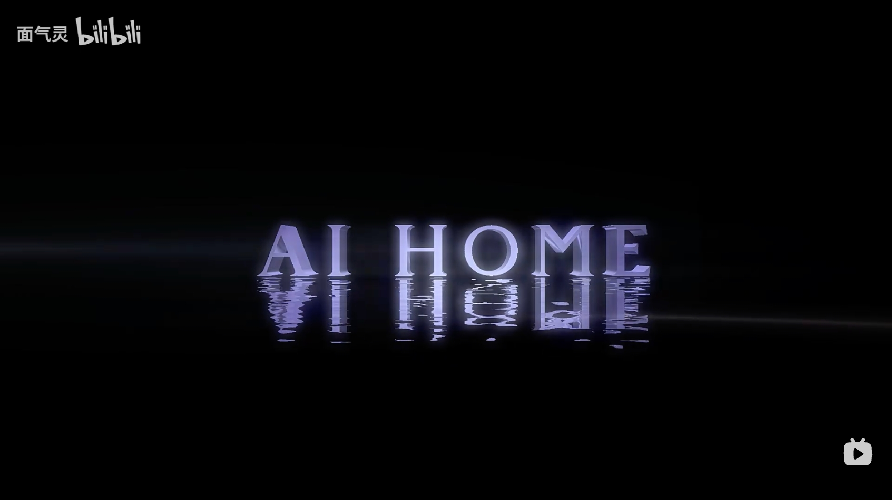
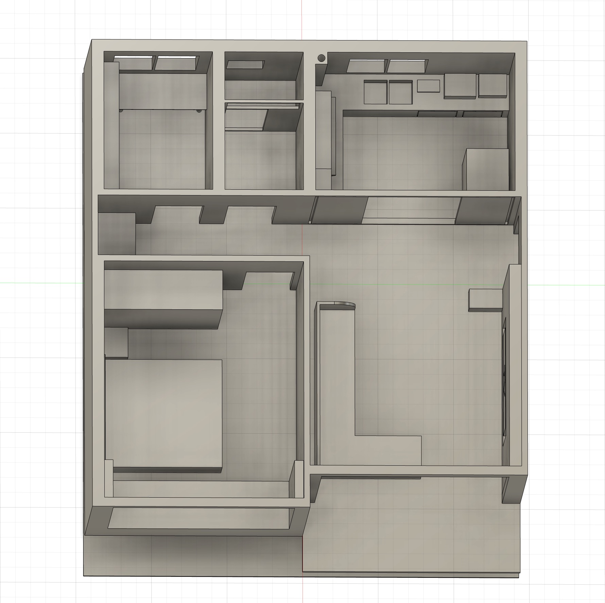
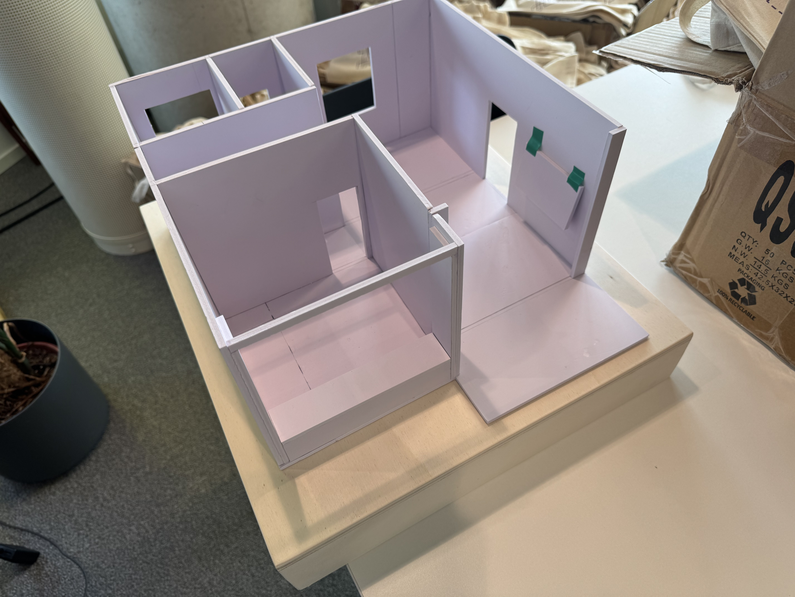
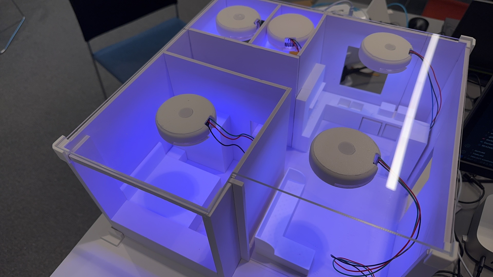
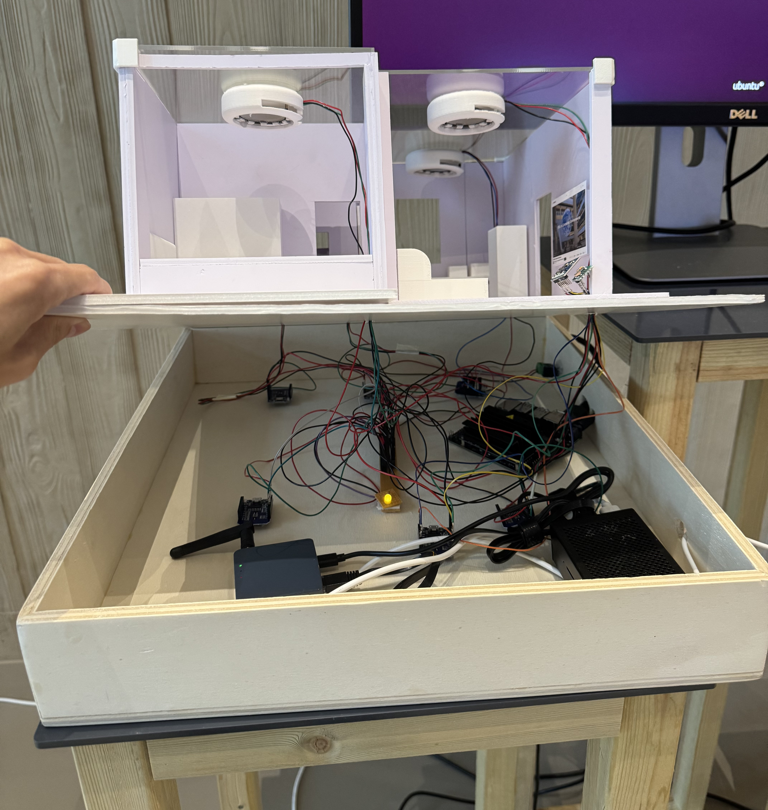
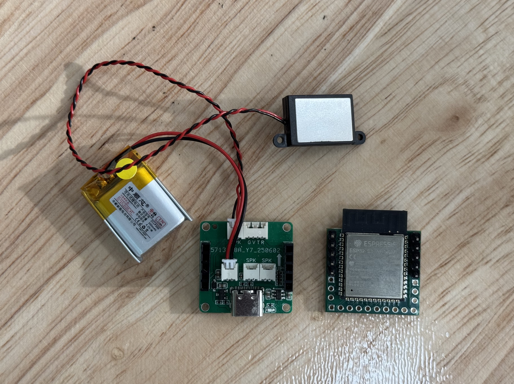
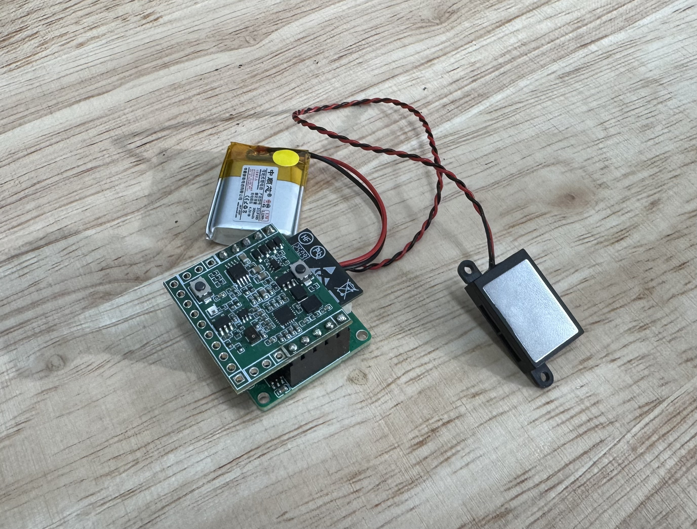
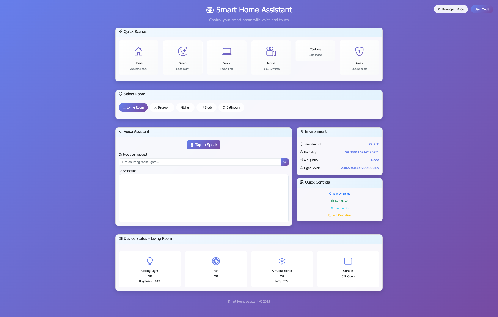
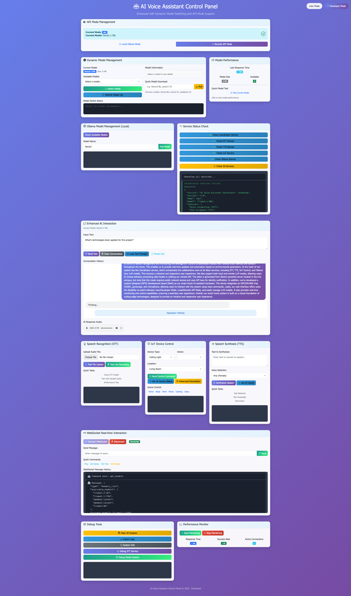
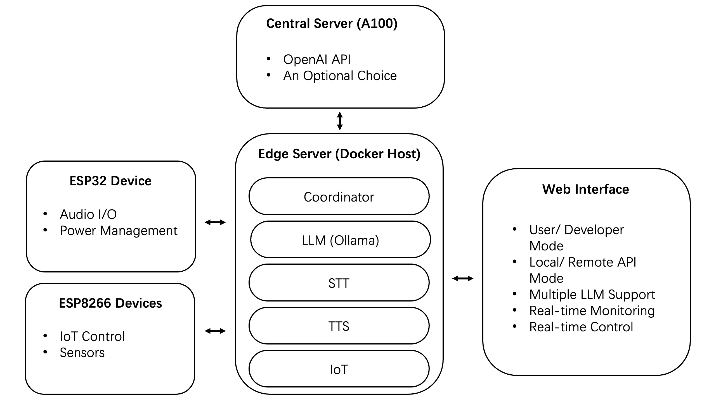

# AI Smart Home Assistant with Edge Computing

[](LICENSE)
[](https://www.docker.com/)
[](https://www.python.org/)
[](https://espressif.com/)

> **Edge Computing and Large Language Model (LLMs) Powered Semantic Frameworks for Connected Smart Homes**

<div style="text-align: center;">
  
</div>
This project proposed a smart home semantic understanding framework that enables natural language interactions through edge computing and LLMs, facilitating a paradigm shift from command-based control to conversational interaction. The system achieves:

- **94%** accuracy in standard command recognition
- **91%** accuracy in fault-tolerant testing
- **96.9%** accuracy in distinguishing commands from non-commands

## ✨ Key Features

### 🚀 Advanced AI Capabilities

- **Intent-based Interaction**: Move beyond command-based to natural conversation
- **Semantic Understanding**: Advanced LLM-powered context awareness
- **Multi-language Support**: English and Chinese voice commands
- **Scene Intelligence**: Automated environment optimization

### 🏡 Comprehensive Smart Home Control

- **Multi-room Support**: Living room, bedroom, kitchen, study, bathroom
- **Device Categories**: Lighting, HVAC, fans, curtains, sensors
- **Environmental Monitoring**: Temperature, humidity, CO2, VOC, light levels
- **Real-time Updates**: WebSocket-based live status monitoring

### 🖥️ Dual Interface Modes

- **User Mode**: Intuitive interface for daily home control
- **Developer Mode**: Advanced testing and debugging tools

### 🔧 Hardware Integration

- **ESP32 Ecosystem**: Audio processing, display control, sensor integration
- **Scalable Architecture**: Easy addition of new devices and rooms
- **Edge Processing**: Reduced latency and enhanced privacy

## 🎯 Overview

### Demo Video

<div align="center">
  <a href="https://www.bilibili.com/video/BV1gSuSzvERY/?spm_id_from=333.1387.homepage.video_card.click&vd_source=d29a5e7864f6cf00667f0891671f69c8">
    
  </a>
  <br>
  <em>Click to watch the full demonstration on Bilibili</em>
</div>

### System Model

<div align="center">
  
  &nbsp;&nbsp;&nbsp;&nbsp;
  
  <br><br>
  
  &nbsp;&nbsp;&nbsp;&nbsp;
  
</div>

### Voice Assistant (Reiki)

<div align="center">
  
  &nbsp;&nbsp;&nbsp;&nbsp;
  
</div>

### Website (User Mode)

<div style="text-align: center;">
  
</div>

### Website (Developer Mode)

<div style="text-align: center;">
  
</div>

## 🏗️ System Architecture

The system consists of **5 microservices** running in Docker containers, designed for collaboration between low-power devices (ESP32) and PC-side Docker containers:

<div style="text-align: center;">
  
</div>

### 🎯 Core Services

| Service       | Port  | Purpose                                           | Health Check |
| ------------- | ----- | ------------------------------------------------- | ------------ |
| 🎯 Coordinator | 8080  | Central orchestration                             | `GET /`      |
| 🎤 STT         | 8000  | Speech-to-Text using OpenAI Whisper               | `GET /`      |
| 🔊 TTS         | 8001  | Text-to-Speech using Microsoft Edge TTS           | `GET /`      |
| 🏠 IoT         | 8002  | Smart device management                           | `GET /`      |
| 🧠 LLM         | 11434 | LLM processing for natural language understanding | `GET /`      |

## 🚀 Quick Start

### Hardware Repo

https://github.com/ReikiC/SmartHome-Hardwares

Notice: The principle design of "Reiki" is refer and modified from: https://oshwhub.com/esp-college/esp-spot 

### Prerequisites

- Docker and Docker Compose

- 8GB+ RAM recommended

- Network access for initial model downloads

### Deploy Procedure

**Clone the repository**

```bash
git clone https://github.com/Reikimen/SmartHome-Docker-LLM.git
cd SmartHome-Docker-LLM
```

**Deploy services using Docker Compose**

```bash
docker-compose up -d --build
```

**Access the web interface**

```bash
cd web
chmod +x start-web.sh
./start-web.sh
```

Or on Ubuntu 18.0:

```bash
cd web
chmod +x start-web-python.sh
./start-web-python.sh
```

**Initialize LLM model** (First time only)

- Access Developer Mode in the web interface
- Navigate to "Dynamic Model Management Module"
- Enter your preferred LLM model in "Quick Model Download"
- Wait 2-10 minutes for download completion

**Stop services**

```bash
docker-compose down
```

### 3D Models

Designed by Fusion 360. Click to access: [SmartHome-Model.f3d](https://github.com/ReikiC/SmartHome-Docker-LLMs/blob/main/SmartHome-Model.f3d)

### Documentation

Click to access: [Documentation](https://github.com/ReikiC/SmartHome-Docker-LLMs/tree/main/Documentation)

## 📄 License

This project is licensed under the MIT License - see the [LICENSE](LICENSE) file for details.

## 🙏 Acknowledgments

- **UCL Centre for Advanced Spatial Analysis** for research support
- **OpenAI** for Whisper speech recognition model
- **Meta** for Llama language models
- **Microsoft** for Edge TTS technology
- **Espressif** for ESP32 platform

**Built with ❤️ for the future of smart homes**