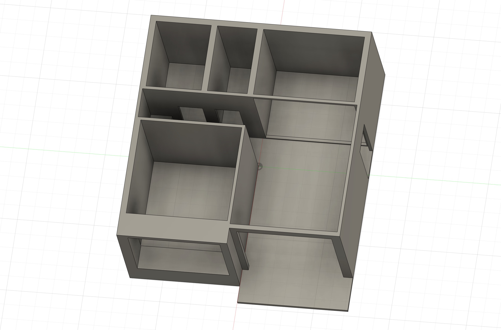
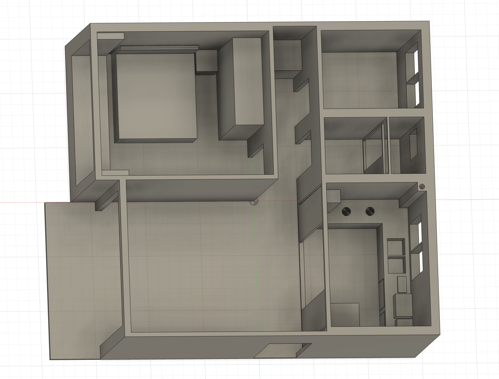
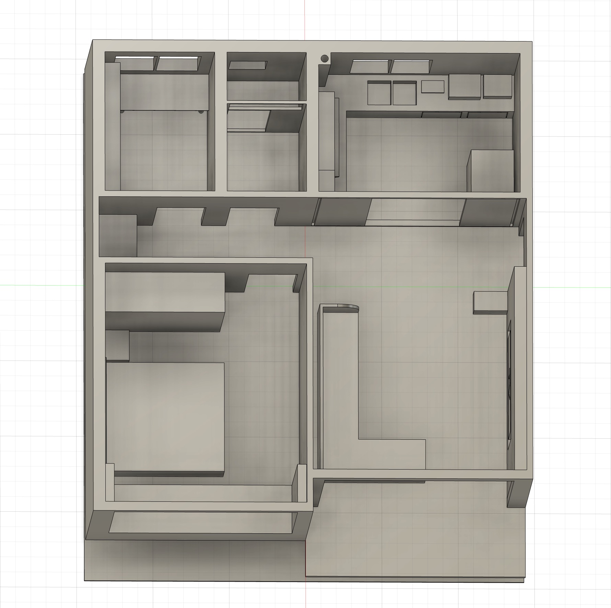

# 第一周

## Day1

### 确定毕设展示方案：

使用紧凑型演示用客厅模型进行展示，确定最终展示形式：

1. 传统智能家居模式（指令式）
2. API辅助家居模式（意图式）
3. 本地化部署语义智能家居模式（意图式）

三种模式采用物理方式切换，暂时没有想好如何在代码中实现。对于学校的展览会，只支持第一种和第二种展示形式。

模式切换方案1: 模式的切换可以使用一个无线开关使用，即将这个物理选择器连接到一块esp上，让esp通过websocket或者MQTT发布消息，所有的家具都订阅对应的topic，然后根据不同的topic内的内容以不同方式运行

### 确定采用的智能设备

- 顶灯（客厅、卧室、厨房、书房、卫浴）
- 台灯（卧室、书房）
- 风扇（客厅、卧室、书房、厨房（换气扇））
- 窗帘（客厅、卧室、书房、卫浴）
- 传感器：麦克风、CO2、VOC、温湿度传感器

### 确定有哪些家具

- 客厅：电视（嵌入展示墙），沙发，茶几，顶灯

- 卧室：顶灯，台灯，床，风扇，床头柜，镜子

- 书房：顶灯，书桌，书柜，风扇

- 厨房：顶灯，灶台，换气扇

- 卫浴：顶灯，窗帘

考虑家居的拓展性，每个家具都配备MCU

## Day 2

在Fusion绘制模型

  

## Day 3

在Fusion绘制模型

  

## Day 4/5

在Fusion绘制模型

  

