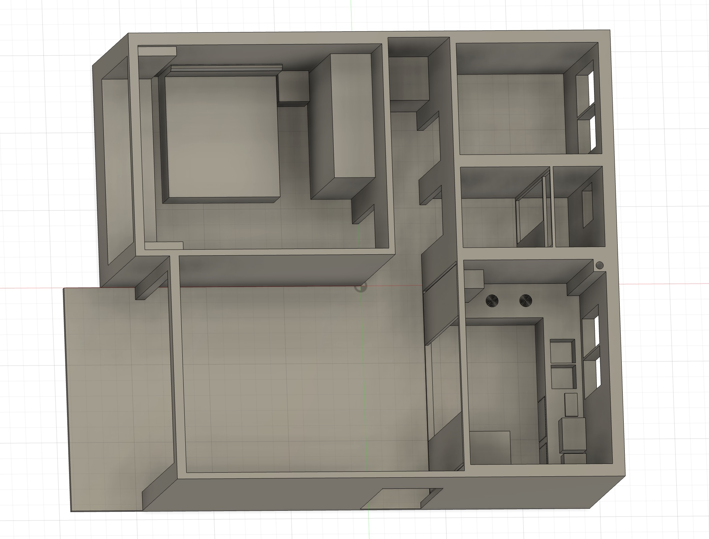
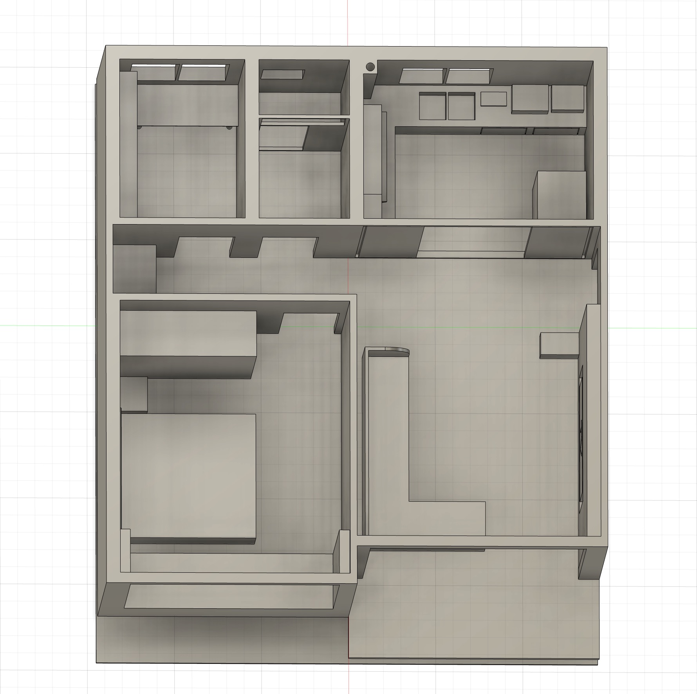

# Week 1

## Day 1

### Determining the Dissertation Demonstration Plan:

Using a compact living room model for demonstration, the final presentation formats have been determined:

1. Traditional smart home mode (command-based)
2. API-assisted home mode (intent-based)
3. Locally deployed semantic smart home mode (intent-based)

The three modes will be switched physically, haven't yet decided how to implement this in code. For the school exhibition, only the first and second demonstration formats will be supported.

Mode switching solution 1: Mode switching can be implemented using a wireless switch connected to an ESP module, which transmits messages via WebSocket or MQTT. All furniture would subscribe to the corresponding topics and operate differently based on the content in different topics.

### Determining Smart Devices to Use

- Ceiling lights (living room, bedroom, kitchen, study, bathroom)
- Desk lamps (bedroom, study)
- Fans (living room, bedroom, study, kitchen (exhaust fan))
- Curtains (living room, bedroom, study, bathroom)
- Sensors: microphone, CO2, VOC, temperature and humidity sensors

### Determining Furniture Items

- Living room: TV (embedded in display wall), sofa, coffee table, ceiling light
- Bedroom: ceiling light, desk lamp, bed, fan, bedside table, mirror
- Study: ceiling light, desk, bookcase, fan
- Kitchen: ceiling light, stove, exhaust fan
- Bathroom: ceiling light, curtains

Considering furniture expandability, each furniture item will be equipped with an MCU.

## Day 2

Creating models in Fusion

  

## Day 3/4

Creating models in Fusion

  

## Day 5

Creating models in Fusion

  

