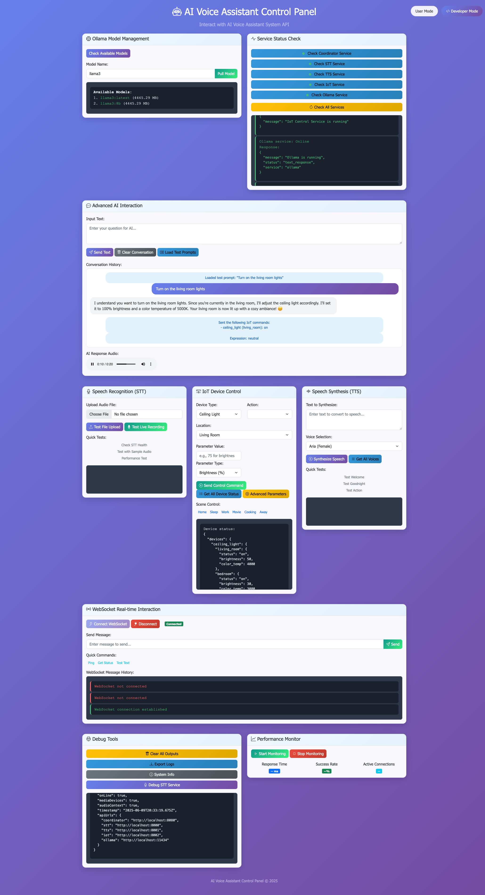
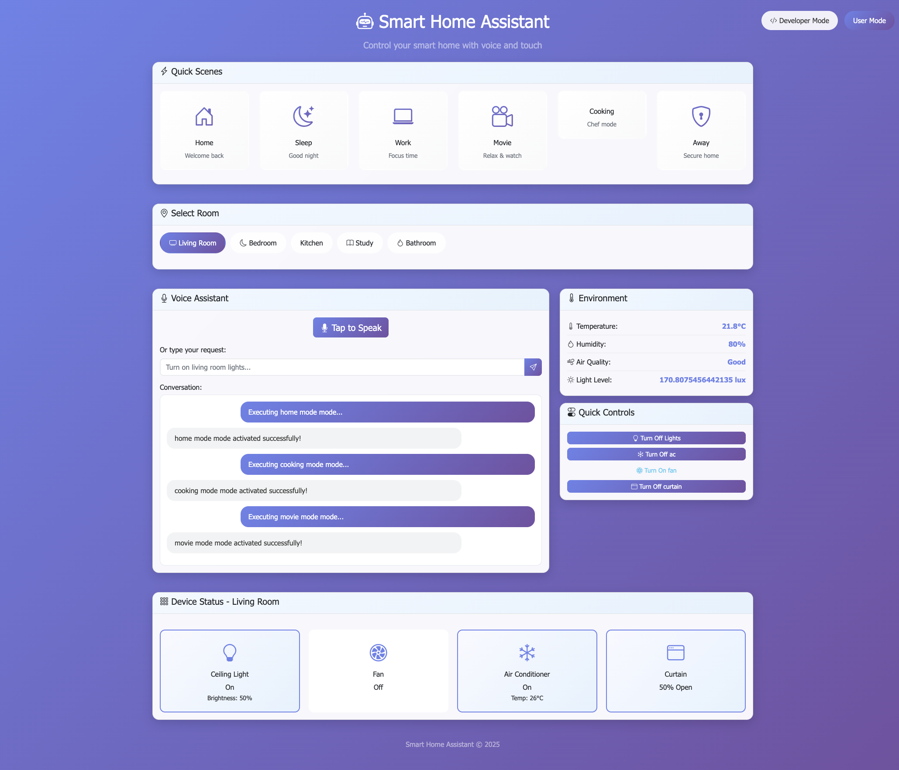

## Week 4
### Developer Mode

  

### User Mode

  

## The work been done:

I did a quick research on esp home, it’s a good platform, however it might not that flexible modify for mine diy system

As for the writing of the thesis, I have merely modified the thesis template, changing the citation format in the template to the Harvard format required by UCL

As for the model construction, the components purchased earlier have been arriving in the past two days, and we can start making it soon. By the way, I wonder if there is any budget available for reimbursement of research expenses. Compared with China, the component costs in the UK are astonishingly high.
